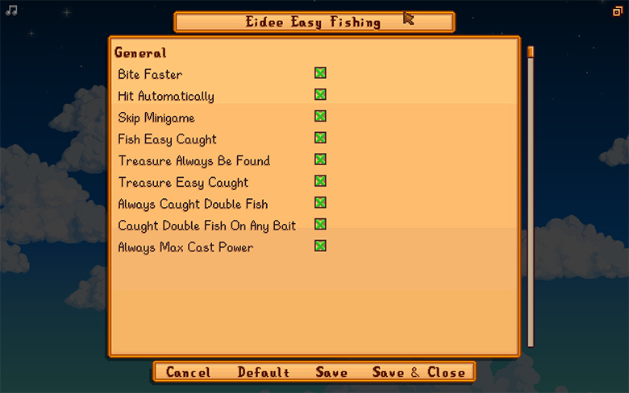

# Eidee Easy Fishing
Customizable Mod for easy fishing.

## Outline:
This Mod was created to make fishing easier. You can customize from your configuration, such as skipping minigame, minigame make easier, always found a Treasure, always double fishing.

## Config:
During the game, you can reload the configuration by pressing the F5 key, and turn the entire mod on or off by pressing the F6 key. It is possible to change the keys from the config.
Starting with version 1.1.1, you can now edit the configuration in the "[Generic Mod Config Menu](https://www.nexusmods.com/stardewvalley/mods/5098)"

| Property                         | Description                                                                                                                     |
| ------------------------------   | ---------------------------------------------------------------------------------------------------------------------           |
| Bite Faster                      | Waiting for fish to bite the bait is no longer necessary.                                                                       |
| Hit Automatically                | Clicking the mouse to start the minigame is not required. If "Skip Minigame" is enabled, the fish will be caught automatically. |
| Treasure Always Be Found         | Discovering treasure is guaranteed on every attempt, even with "Skip Minigame" enabled.                                         |
| Always Golden Treasure           | Whenever treasure appears, whether naturally or forced, it will always be a golden treasure chest.                              |
| Always Caught Double Fish        | Using Wild Bait always results in catching two fish.                                                                            |
| Caught Double Fish On Any Bait   | The chance to catch two fish is present with any bait used, and can be combined with "Always Caught Double Fish".               |
| Fish Appear Regardless of Season | Lets you catch fish that would normally be unavailable due to season or location, just like Magic Bait.                         |
| Higher Chance for Rare Fish      | Makes harder-to-find fish more likely to bite, just like a Curiosity Lure.                                                      |
| Always Max Cast Power            | Casting power is always at its maximum.                                                                                         |
| Auto Recast                      | After you cast manually, advances each catch display and casts again. Always cancel with a menu or movement control. Disabled by default. |
| Stop Auto Recast At Time         | Sets the safe-stop time for Auto Recast. Disabled by default.                                                                   |
| Auto Collect Fishing Treasure    | Moves fishing treasure and catch-menu items into your inventory automatically. Disabled by default.                             |
| Skip Minigame                    | The minigame is skipped, and fish are caught automatically, always achieving a perfect catch.                                   |
| Fish Easy Caught                 | In the minigame, the fish icon automatically chases the bar.                                                                    |
| Treasure Easy Caught             | In the minigame, the treasure icon automatically chases the bar.                                                                |
| Always Reveal Fish Type          | Shows which fish you are catching during the minigame, even without a Sonar Bobber equipped.                                    |
| Always Max Fish Quality          | Forces every caught fish to Iridium quality, ignoring Quality Bobber count, rod tier, and perfect-catch requirements.           |
| Always Max Fish Size             | Forces every caught fish to its maximum recorded length, ignoring rod tier and the per-frame size penalty during the minigame.  |
| Fish Movement Speed Multiplier   | This is a multiplier for the fish's movement speed in the minigame.                                                             |
| Progress Bar Decrease Multiplier | This modifies how quickly the capture progress bar decreases in the minigame.                                                   |
| Progress Bar Increase Multiplier | This modifies how quickly the capture progress bar increases in the minigame.                                                   |
| Treasure Catch Speed Multiplier  | This is a multiplier for the speed at which treasure is caught in the minigame.                                                 |
| Reload Config                    | This sets the key for reloading the configuration.                                                                              |
| Toggle Mod                       | This sets the key for turning the entire mod on or off at runtime, without opening the config menu.                             |
| Stop Auto Recast                 | Sets the key for stopping Auto Recast. Available only in config.json and disabled (`None`) by default.                          |

## Stardew Valley 1.6 Notes:
Easy Fishing now covers the catch-side mechanics introduced in 1.6:

- **Challenge Bait** — Skip Minigame catches the remaining `challengeBaitFishes` count instead of a single fish, matching how the bait counts down on escapes.
- **Deluxe Bait** — The +12 px bar growth applied by the constructor is read back at catch time, so the mod's bar-position math stays correct.
- **Sonar Bobber** — The fish identity panel is honored as-equipped; *Always Reveal Fish Type* injects it without consuming a tackle slot.
- **Mastery (Fishing) golden treasure** — Post-added treasure (from *Treasure Always Be Found*) inherits the Mastery(1) golden roll (`< 0.25 + AverageDailyLuck`) so vanilla rolls are not changed.
- **Statue of Blessings (Blessing of Waters)** — Compatible: the mod's progress-bar multipliers stack on top of the game's reduced penalty modifier without replacing it.
- **Fish Frenzy** — Bite Faster zeros the bite timer, which already short-circuits the frenzy-time halving; the mod does not target frenzy spawns.
- **Beginner's Rod** — Skip Minigame inherits the rod's quality/size floors unless *Always Max Fish Quality* / *Always Max Fish Size* are enabled, in which case the override wins.
- **Tutorial first cast** — The 0.1 starting `distanceFromCatching` for the first-ever fish is preserved instead of being stomped to 0.3.

*Fish Appear Regardless of Season* and *Higher Chance for Rare Fish* are the only options that change **which** fish is selected. They work by inserting a synthetic Magic Bait / Curiosity Lure into the rod's bait or tackle slot during the bite-wait window, and restoring the original as soon as the BobberBar opens (or the cast ends), before any bait/tackle consumption runs. *Fish Appear Regardless of Season* inserts the synthetic Magic Bait even when the bait slot is empty, so it applies whether or not you have bait equipped. The original bait stack and tackle durability are never decremented by the substitute, and the synthetic item is also restored before save and day-end so it cannot leak into a save file. Challenge Bait's catch counter and Deluxe Bait's larger bar height are replayed onto the BobberBar after restore so those bait effects are preserved alongside the Magic Bait selection. Specific Bait targeting is suppressed for casts where *Fish Appear Regardless of Season* is in effect. When *Higher Chance for Rare Fish* runs on a rod whose tackle slots are all occupied, the synthetic temporarily replaces the first tackle slot for one cast — that slot's BobberBar-construction-time effect (e.g. Cork Bobber's bar growth, and similar tackle effects) is suppressed for that single cast, while the tackle item itself and its durability are still restored before any consumption. *Fish Appear Regardless of Season* also suppresses Wild / Challenge / Deluxe Bait's faster bite-time multiplier on missed-bite re-rolls within the same cast (the first-bite timer is computed before the swap and uses the original bait correctly); enable *Bite Faster* if you want the bite-wait window to stay short regardless.

Recasts initiated by *Auto Recast* always use full power, regardless of *Always Max Cast Power*. After each catch, the mod advances the fish hold-up automatically so the loop can continue. A running loop can always be canceled with the player's current menu key or any movement key, or with controller Start, B, or a D-pad direction. The input is only observed, so its normal game action still happens; in particular, using a movement key to steer an airborne bobber also cancels the loop.

Before each recast the mod predicts where a full-power cast from your current position and facing would land and skips the cast when that predicted tile is not fishable. This is a pre-dispatch prediction, not an absolute guarantee about the bobber's final tile: movement input can steer an airborne bobber, and the game can adjust an unsteered landing by one perpendicular tile. The loop also stops itself before a cast would drop your stamina to zero; it never eats food or restores stamina for you. Casts that cost no stamina at all, from an Efficient rod or while Statue of Blessings (Blessing of Waters) is active, do not trigger that stop. Both the stamina stop and the optional stop time open the game menu, but this freezes the clock only in single-player. In multiplayer, the clock keeps running while the menu is open.

*Auto Collect Fishing Treasure* is independent of *Auto Recast*. It transfers items from fishing treasure and catch menus into your inventory and closes the menu only when every item fits on that attempt. If an item fits only partially or not at all, its remainder stays in the menu, and the mod then leaves that menu entirely to you until you close it yourself — it will not take over again even if you free up space, and it never acts while you are holding an item on the cursor. While such a menu is open, *Auto Recast* also waits rather than starting the next cast.

**Multiplayer**: the two selection-altering options (*Fish Appear Regardless of Season*, *Higher Chance for Rare Fish*) are silently disabled in multiplayer sessions. The fishing rod's attachment slots are network-synced, so swapping in a synthetic on a farmhand could be persisted by the host's save (e.g. on disconnect). All other options work normally in multiplayer.

The progress bar multipliers affect the amount the bar changes from frame to frame. They do not replace the game's own bait, lure, or penalty rules.

## Contacts:
[Open an issue](https://github.com/eideehi/sdv-easyfishing/issues) for bug reports, questions, suggestions, and requests.

## Credits:
* Dependencies:
  * [Generic Mod Config Menu](https://www.nexusmods.com/stardewvalley/mods/5098)

# License:
Eidee Easy Fishing is developed and released under the [MIT license](./LICENSE), except for the APIs of the libraries it depends on.
